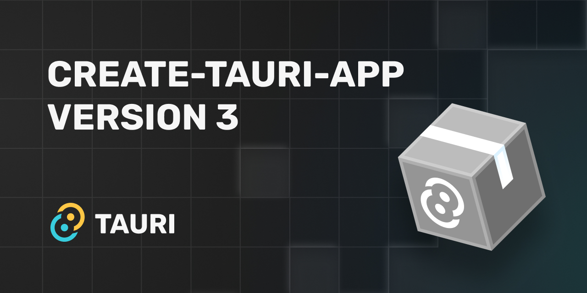

A new major version of [create-tauri-app](https://github.com/tauri-apps/create-tauri-app) has been released. This version adds support for the alpha version of Tauri 2.0, the ability to initialize iOS and Android projects and removes some less commonly used templates to make the project more maintainable.

## Tauri 2.0 Alpha & Mobile Support

The [first alpha version of Tauri 2.0 was published almost 3 months ago](https://tauri.app/blog/2022/12/09/tauri-mobile-alpha) which brought initial mobile support for Android and iOS. Previously there wasn't an easy way to create a new project to test either the changes in the alpha version nor the mobile support. Well, that ends now!

Starting with version 3 of [create-tauri-app](https://github.com/tauri-apps/create-tauri-app), you can now pass `--beta` flag and it will bootstrap an app that uses `tauri@2.0.0-beta`. When adding the `--beta` flag it will automatically prompt you if you'd like to add mobile support. You can also use the `--mobile` flag to automatically make it mobile compatible.

To get started:

```bash
# pnpm
pnpm create tauri-app --alpha

# yarn
yarn create tauri-app --alpha

# npm
npm create tauri-app -- --alpha

# Cargo
cargo install create-tauri-app --locked
cargo create-tauri-app --alpha

# Bash
sh <(curl https://create.tauri.app/sh) --alpha

# Powershell
$env:CTA_ARGS="--alpha";iwr -useb https://create.tauri.app/ps | iex
```

## Prompt Improvements

With version 2 of create-tauri-app we also focused on improving the flow and experience of the prompted questions.

Previously the second prompt would ask "Choose your package manager". This was a bit vague and could leave some with unanswered questions:

- What is `cargo`?
- Is it a new Node.js package manager?
- Why choose it over `pnpm` or `yarn`?

This would be even more vague if we decided to add a new frontend language (such as a webassembly Golang web application). We added a prompt asking to choose the package manager to ask which language would you prefer. It looks something like this:

```
? Choose which language to use for your frontend ›
  Rust
❯ TypeScript / JavaScript  (pnpm, yarn, npm)
```

After choosing the frontend language create-tauri-app will then prompt for package manager to use if the language has multiple (such as Node.js with npm, yarn, and pnpm).

Another prompt that we felt problematic was the template selection prompt. It contained a lot of templates to choose from and was only growing with time:

```
✔ Choose your package manager · pnpm
? Choose your UI template ›
  vanilla
  vanilla-ts
  vue
❯ vue-ts
  svelte
  svelte-ts
  react
  react-ts
  solid
  solid-ts
  next
  next-ts
  preact
  preact-ts
  angular
  clojurescript
  svelte-kit
  svelte-kit-ts
```

We decided to split this up into 2 prompts. The first will ask which UI template to use:

```
✔ Choose your package manager · pnpm
? Choose your UI template ›
  Vanilla
❯ Vue
  Svelte
  React
  Solid
  Angular
  Next
  SvelteKit
  ClojureScript
  Preact
```

And then the second will then ask any additional choices that are specific to that template (such as choosing between TypeScript or JavaScript for Vue):

```
✔ Choose your package manager · pnpm
✔ Choose your UI template · Vue - (https://vuejs.org)
? Choose your UI flavor ›
❯ TypeScript
  JavaScript
```

Even with these refinements the list of templates was still quite large and would only grow over time. The next thing to look at was the list of templates themselves.

## Removing Templates

When create-tauri-app version 2 was launched it quickly received PRs to add additional templates beyond what it originally launched with. While it was exciting to receive so much support from the community, it did bring up a couple of new challenges:

- It made it almost impossible to fit them in a single prompt
- Maintaining all the templates was becoming more difficult

It was a hard balance between showing how flexible Tauri is but also making sure that the project was maintainable and had the DX that we wanted.

We decided to focus on the most popular frontend frameworks and used guidance from community surveys like [The State of JS](https://2022.stateofjs.com/en-US/libraries/front-end-frameworks/) and our own Tauri community feedback. With this we removed the `next`, `next-ts`, `preact`, `preact-ts`, `clojurescript`, `svelte-kit` and `svelte-kit-ts` templates and also closed PRs which aimed to add more templates.

## Community-Maintained Templates & Previous Versions

We want to make sure that we offer a place for the Tauri community to provide their own templates for the frameworks they love. The templates section of [awesome-tauri](https://github.com/tauri-apps/awesome-tauri#templates) is just the place for that. We invite the community to submit a PR to the awesome-tauri repo with their templates so that they can be shared with the Tauri community. We'll also be creating a section on the Tauri website to highlight and showcase these community templates.

If you'd still like to use the previous templates from version 2 of create-tauri-app they are still published to npm and crates.io. Here's how you can use a previous version:

```bash
# pnpm
pnpm create tauri-app@2

# yarn
yarn create tauri-app@2

# npm
npm create tauri-app@2

# Cargo
cargo install create-tauri-app --version 2.8.0 --locked
cargo create-tauri-app

# Bash
sh <(curl https://create.tauri.app/v/2.8.0/sh)

# Powershell
iwr -useb https://create.tauri.app/v/2.8.0/ps | iex
```

However, as time goes, these templates will become out of date as Tauri and the frontend frameworks move forward. We'd recommend you look at the community templates in the [awesome-tauri](https://github.com/tauri-apps/awesome-tauri) repo and welcome submissions if something is missing.

---

We hope that these changes make it easier for the community to try out the alpha and beta versions of Tauri 2.0 and also make the process to create a new Tauri app easier for everyone! We'd love to hear your feedback and invite you to join the conversation on the [GitHub Discussion for this post](https://github.com/tauri-apps/tauri-docs/discussions/1137).
