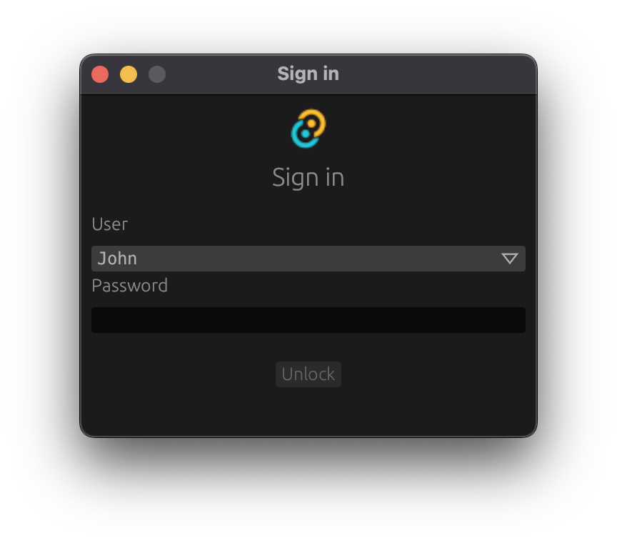

The Tauri team is pleased to announce the first release of [tauri-egui](https://github.com/tauri-apps/tauri-egui).

[`egui`](https://github.com/emilk/egui) is a GUI library written in Rust. It leverages an OpenGL context via [glutin](https://github.com/rust-windowing/glutin).

tauri-egui is a Tauri plugin that connects with the Tauri runtime event loop to allow you to create glutin windows via our [glutin fork](https://github.com/tauri-apps/glutin)
and use egui through our [egui-tao](https://github.com/tauri-apps/egui) integration.

## Setup

The first step is to add the crate to your dependencies in Cargo.toml:

```toml
[dependencies]
tauri-egui = "0.1"
```

Now you need to enable the plugin:

```rust
fn main() {
  tauri::Builder::default()
    .setup(|app| {
      app.wry_plugin(tauri_egui::EguiPluginBuilder::new(app.handle()));
      Ok(())
    })
}
```

## Create an egui layout

To use egui, all you need to do is implement the `tauri_egui::eframe::App` trait to render elements using the egui API. In the following example, we will create a login layout.

- Define the struct that will be used to render the layout:

```rust
use std::sync::mpsc::{channel, Receiver, Sender};
use tauri_egui::{eframe, egui};

pub struct LoginLayout {
  heading: String,
  users: Vec<String>,
  user: String,
  password: String,
  password_checker: Box<dyn Fn(&str) -> bool + Send + 'static>,
  tx: Sender<String>,
  texture: Option<egui::TextureHandle>,
}

impl LoginLayout {
  pub fn new(
    password_checker: Box<dyn Fn(&str) -> bool + Send + 'static>,
    users: Vec<String>,
  ) -> (Self, Receiver<String>) {
    let (tx, rx) = channel();
    let initial_user = users.iter().next().cloned().unwrap_or_else(String::new);
    (
      Self {
        heading: "Sign in".into(),
        users,
        user: initial_user,
        password: "".into(),
        password_checker,
        tx,
        texture: None,
      },
      rx,
    )
  }
}
```

- Implement `tauri_egui::eframe::App` to use the egui APIs:

```rust
impl eframe::App for LoginLayout {
  // Called each time the UI needs repainting
  // see https://docs.rs/eframe/latest/eframe/trait.App.html#tymethod.update for more details
  fn update(&mut self, ctx: &egui::Context, frame: &mut eframe::Frame) {
    let Self {
      heading,
      users,
      user,
      password,
      password_checker,
      tx,
      ..
    } = self;

    let size = egui::Vec2 { x: 320., y: 240. };
    // set the window size
    frame.set_window_size(size);

    // adds a panel that covers the remainder of the screen
    egui::CentralPanel::default().show(ctx, |ui| {
      // our layout will be top-down and centered
      ui.with_layout(egui::Layout::top_down(egui::Align::Center), |ui| {
        // we will start adding elements here in the next sections
      });
    });
  }
}
```

- Define some helper functions we will use:

```rust
fn logo_and_heading(ui: &mut egui::Ui, logo: egui::Image, heading: &str) {
  let original_item_spacing_y = ui.style().spacing.item_spacing.y;
  ui.style_mut().spacing.item_spacing.y = 8.;
  ui.add(logo);
  ui.style_mut().spacing.item_spacing.y = 16.;
  ui.heading(egui::RichText::new(heading));
  ui.style_mut().spacing.item_spacing.y = original_item_spacing_y;
}

fn control_label(ui: &mut egui::Ui, label: &str) {
  let original_item_spacing_y = ui.style().spacing.item_spacing.y;
  ui.style_mut().spacing.item_spacing.y = 8.;
  ui.label(label);
  ui.style_mut().spacing.item_spacing.y = original_item_spacing_y;
}
```

- Load an image, allocate it as a texture and add it to the UI (requires the `png` dependency):

```rust
let texture: &egui::TextureHandle = self.texture.get_or_insert_with(|| {
  let mut reader = png::Decoder::new(std::io::Cursor::new(include_bytes!("icons/32x32.png")))
  .read_info()
  .unwrap();
  let mut buffer = Vec::new();
  while let Ok(Some(row)) = reader.next_row() {
    buffer.extend(row.data());
  }
  let icon_size = [reader.info().width as usize, reader.info().height as usize];
  // Load the texture only once.
  ctx.load_texture(
    "icon",
    egui::ColorImage::from_rgba_unmultiplied(icon_size, &buffer),
    egui::TextureFilter::Linear,
  )
});
logo_and_heading(
  ui,
  egui::Image::new(texture, texture.size_vec2()),
  heading.as_str(),
);
```

- Add the user selection ComboBox:

```rust
ui.with_layout(egui::Layout::top_down(egui::Align::Min), |ui| {
  control_label(ui, "User");
  egui::ComboBox::from_id_source("user")
    .width(ui.available_width() - 8.)
    .selected_text(egui::RichText::new(user.clone()).family(egui::FontFamily::Monospace))
    .show_ui(ui, move |ui| {
      for user_name in users {
        ui.selectable_value(user, user_name.clone(), user_name.clone());
      }
    })
    .response;
});
```

- Add an entry for password input:

```rust
ui.style_mut().spacing.item_spacing.y = 20.;

let textfield = ui
  .with_layout(egui::Layout::top_down(egui::Align::Min), |ui| {
    ui.style_mut().spacing.item_spacing.y = 0.;
    control_label(ui, "Password");
    ui.horizontal_wrapped(|ui| {
      let field = ui.add_sized(
        [ui.available_width(), 18.],
        egui::TextEdit::singleline(password).password(true),
      );
      field
    })
    .inner
  })
  .inner;
```

- Add a submit button:

```rust
let mut button = ui.add_enabled(!password.is_empty(), egui::Button::new("Unlock"));
button.rect.min.x = 100.;
button.rect.max.x = 100.;
```

- Handle submit:

```rust
if (textfield.lost_focus() && ui.input().key_pressed(egui::Key::Enter)) || button.clicked()
{
  if password_checker(&password) {
    let _ = tx.send(password.clone());
    password.clear();
    frame.close();
  } else {
    *heading = "Invalid password".into();
    textfield.request_focus();
  }
}
```

Now that we have created the layout, let's put it on a window and show it in the Tauri application:

```rust
use tauri::Manager;
fn main() {
  tauri::Builder::default()
    .setup(|app| {
      app.wry_plugin(tauri_egui::EguiPluginBuilder::new(app.handle()));

      // the closure that is called when the submit button is clicked - validate the password
      let password_checker: Box<dyn Fn(&str) -> bool + Send> = Box::new(|s| s == "tauri-egui-released");

      let (egui_app, rx) = LoginLayout::new(
        password_checker,
        vec!["John".into(), "Jane".into(), "Joe".into()],
      );
      let native_options = tauri_egui::eframe::NativeOptions {
        resizable: false,
        ..Default::default()
      };

      app
        .state::<tauri_egui::EguiPluginHandle>()
        .create_window(
          "login".to_string(),
          Box::new(|_cc| Box::new(egui_app)),
          "Sign in".into(),
          native_options,
        )
        .unwrap();

      // wait for the window to be closed with the user data on another thread
      // you don't need to spawn a thread when using e.g. an async command
      std::thread::spawn(move || {
        if let Ok(signal) = rx.recv() {
          dbg!(signal);
        }
      });

      Ok(())
    })
    .run(tauri::generate_context!())
    .expect("error while running tauri application")
}
```

Here's how it will look on **all** platforms:



To customize the look and feel of your egui application, check out the [Context#set_style API](https://docs.rs/egui/latest/egui/struct.Context.html#method.set_style).
